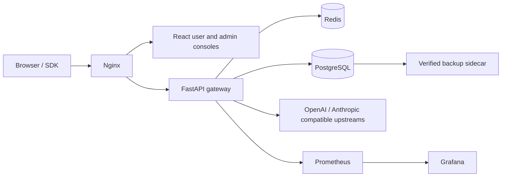

<div align="center">

# Open API Platform

**A self-hosted, multi-provider LLM API gateway and operations console.**

Expose OpenAI- and Anthropic-compatible endpoints while keeping model routing,
credentials, usage analytics, traffic governance, and platform operations under
your control.

[](LICENSE)


[Quick start](#quick-start) ·
[Features](#features) ·
[API compatibility](#api-compatibility) ·
[Production deployment](#production-deployment) ·
[Editions](#community-and-enterprise-editions) ·
[Documentation](#documentation) ·
[Contributing](#contributing)

[English](README.md) · [简体中文](README.zh-CN.md)

</div>

> [!IMPORTANT]
> This public snapshot contains no real users, API keys, request logs, upstream
> credentials, organization names, or infrastructure topology from the former
> internal deployment. Optional demo data is entirely fictional and all demo
> keys are non-functional.

## Community and Enterprise editions

This repository is the **public Apache-2.0 Community edition**. Every
project-authored file stored here is open-source; it contains no proprietary
Enterprise implementation. Commercial capabilities are developed in a
separate private `apiplatform-enterprise` repository that depends on versioned
Community releases through the optional extension API.

The exact ownership, licensing, compatibility, and change-flow rules are
documented in [Community and Enterprise edition boundaries](docs/EDITION_BOUNDARIES.md)
and machine-readable [EDITION.json](EDITION.json).

## Why Open API Platform?

Teams often need more than a reverse proxy when exposing multiple LLMs. Open
API Platform combines the data plane and the operational control plane in one
self-hosted stack:

| Unified access | Governance | Operations | Deploy anywhere |
| --- | --- | --- | --- |
| OpenAI and Anthropic compatible APIs, streaming SSE, provider-independent model IDs | Per-key RPM/TPM limits, fallback, circuit breaking, audit logs, controlled key delivery | User and admin consoles, usage analytics, health views, reports, Prometheus and Grafana | Docker Compose, loopback-safe defaults, verified PostgreSQL backups, offline deployment bundles |

## Features

- **Multi-provider gateway** — relay Chat Completions, Completions, Responses,
  Embeddings, Models, and Anthropic Messages through a consistent endpoint.
- **Streaming and resilience** — asynchronous SSE relay, routing, fallback,
  optional circuit breaking, connection budgets, and multi-node state.
- **Key and account lifecycle** — issue, claim, regenerate, revoke, and restore
  API keys without retaining recoverable client-key plaintext.
- **Traffic governance** — Redis-backed cross-instance RPM/TPM enforcement with
  per-key overrides and explicit failover behavior.
- **Operational visibility** — request metadata, token and latency statistics,
  heatmaps, reports, audit logs, Prometheus metrics, and Grafana dashboards.
- **Configurable branding** — platform name, organization, support and approval
  teams, contact details, footer, and localized copy are managed in the admin
  console rather than compiled into the frontend.
- **Hardened local authentication** — first-admin claim, strong passwords,
  rate-limited login, HttpOnly cookies, and server-side session invalidation.
- **Private and offline deployment** — self-contained fonts and assets,
  hardened containers, sanitized demo data, and air-gapped image bundles.

## API compatibility

| API style | Endpoint | Streaming |
| --- | --- | :---: |
| OpenAI Chat Completions | `POST /v1/chat/completions` | Yes |
| OpenAI Completions | `POST /v1/completions` | Yes |
| OpenAI Responses | `POST /v1/responses` | Yes |
| OpenAI Embeddings | `POST /v1/embeddings` | No |
| OpenAI Models | `GET /v1/models` | — |
| Anthropic Messages | `POST /v1/messages` | Yes |
| Anthropic token counting | `POST /v1/messages/count_tokens` | No |

Compatibility covers the gateway contract implemented by this project; it does
not imply support for every provider-specific extension.

## Architecture



Nginx serves the web applications and proxies API traffic. FastAPI owns
authentication, routing, governance, and relay behavior. PostgreSQL stores
configuration and durable operational data; Redis coordinates rate limits,
caches, and cross-worker state.

See [Technical architecture](docs/TECHNICAL.md) for implementation details.

## Quick start

### Prerequisites

- Docker with Docker Compose
- Python 3.11 or later
- Node.js 24 or later

Start the development stack:

```bash
./dev.sh
```

The script prepares PostgreSQL, Redis, the Python environment, database
migrations, the FastAPI server, and the Vite frontend.

| Service | Local address |
| --- | --- |
| Web console | <http://localhost:5173> |
| Admin console | <http://localhost:5173/admin.html> |
| Backend health | <http://localhost:8010/health> |

```bash
./dev.sh --status    # inspect local services
./dev.sh --logs      # follow backend logs
./dev.sh --stop      # stop app processes and development Redis
```

> [!NOTE]
> Development credentials are intentionally marked as local-only. Production
> startup rejects missing, weak, or repository example secrets.

## Production deployment

The repository includes two Compose entry points:

| File | Use case | Command |
| --- | --- | --- |
| `docker-compose.yml` | Build the backend and web images from a source checkout | `docker compose up -d --build --wait` |
| `docker-compose.app.yml` | Run prebuilt release images or an offline bundle | `docker compose -f docker-compose.app.yml up -d --wait` |

The standard source deployment starts Nginx, FastAPI, PostgreSQL, Redis,
hourly verified backups, Prometheus, and Grafana. Persistent state is kept in
Compose-managed volumes and is not stored in the source checkout.

### 1. Create the environment file

```bash
cp .env.example .env
```

Generate a different random value for each of `POSTGRES_PASSWORD`,
`REDIS_PASSWORD`, `JWT_SECRET`, and `ADMIN_BOOTSTRAP_TOKEN`:

```bash
openssl rand -hex 32
```

Generate the independent 32-byte URL-safe key used for encrypted database
fields:

```bash
openssl rand -base64 32 | tr '/+' '_-' | tr -d '=\n'
```

Store the result as `DATA_ENCRYPTION_KEY`. Never reuse a database password,
JWT secret, or encryption key, and never commit `.env`.

For a blank production instance, change `DEMO_DATA_ENABLED=false`. Keep
`HTTP_BIND_ADDRESS=127.0.0.1` until the first administrator is claimed.

### 2. Validate, build, and start with Docker Compose

```bash
# Resolve the complete configuration and fail before building if a required
# variable is missing or empty.
docker compose --env-file .env config >/dev/null

# Build the two project images, start the complete stack, and wait for health.
docker compose --env-file .env up -d --build --wait

docker compose ps
curl --fail http://127.0.0.1/health
```

If your Compose release does not support `--wait`, omit it and run
`docker compose ps` until `postgres`, `redis`, `backend`, and `nginx` are
healthy. The backend automatically serializes and applies Alembic migrations;
do not run a separate first-start seed command. If `HTTP_PORT` is not `80`,
include the configured port in the health URL.

The default production endpoints bind to `127.0.0.1`:

| Service | Default address |
| --- | --- |
| Web console | <http://127.0.0.1/> |
| Admin console | <http://127.0.0.1/admin.html> |
| Health check | <http://127.0.0.1/health> |
| Prometheus | <http://127.0.0.1:9090> |
| Grafana | <http://127.0.0.1:3000> |

Keep the deployment on loopback until administrator bootstrap is complete.
Then expose it through a trusted TLS reverse proxy, a specific management
network address, or an explicit `HTTP_BIND_ADDRESS`.

### 3. Operate and upgrade the stack

```bash
# Follow application logs without printing the complete history.
docker compose logs -f --tail=200 backend nginx

# Rebuild after updating the source checkout and roll services forward.
docker compose build --pull backend nginx
docker compose up -d --wait --remove-orphans

# Stop containers while retaining databases, backups, and dashboards.
docker compose down
```

Do not run `docker compose down --volumes` on a production project: it deletes
PostgreSQL, Redis, backup, Grafana, Prometheus, and usage-failover volumes.
Before every upgrade, export a verified backup and retain the matching
`DATA_ENCRYPTION_KEY`:

```bash
bash scripts/export-backup.sh
```

Container logs rotate at 10 MB × 5 files per service by default. Override
`DOCKER_LOG_MAX_SIZE` and `DOCKER_LOG_MAX_FILES` in `.env` when the host has a
different logging policy.

To deploy prebuilt images instead of compiling source, set `BACKEND_IMAGE` and
`NGINX_IMAGE` in `.env` to the exact release tags, then run:

```bash
docker compose --env-file .env -f docker-compose.app.yml pull
docker compose --env-file .env -f docker-compose.app.yml up -d --wait
```

### 4. Claim the first administrator

There is no built-in admin password. On the first visit to `/admin.html`, the
administrator creates a strong password. The database stores only a versioned
PBKDF2-SHA256 hash.

Set a one-time `ADMIN_BOOTSTRAP_TOKEN` before startup. The first claim must
provide this token; it is no longer involved after initialization. Database
locking makes the first-claim operation concurrency-safe.

> [!WARNING]
> Complete the first-admin claim from localhost or a trusted network before
> exposing the service. This distribution intentionally contains no external
> SSO, OAuth, SAML, OIDC, or CAS login integration.

### 5. Configure the platform

After login, use **Admin → Branding** to configure platform and brand names,
organization, support and approval teams, contact details, footer copy, and
localized display text. These values are stored in PostgreSQL and do not
require a frontend rebuild.

### Essential configuration

| Variable | Purpose | Production guidance |
| --- | --- | --- |
| `POSTGRES_PASSWORD` | PostgreSQL credential | Required; unique random value |
| `REDIS_PASSWORD` | Redis credential | Required; unique random value |
| `JWT_SECRET` | Session and token signing | Required; do not reuse another secret |
| `DATA_ENCRYPTION_KEY` | AES-256-GCM database field encryption | Required; independent 32-byte base64url value |
| `ADMIN_BOOTSTRAP_TOKEN` | One-time first-admin claim | Strongly recommended |
| `SESSION_COOKIE_SECURE` | Restrict cookies to HTTPS | Set to `true` behind TLS |
| `HTTP_BIND_ADDRESS` | Public web bind address | Keep `127.0.0.1` during bootstrap |
| `DEMO_DATA_ENABLED` | Load fictional data into a new empty database | Set to `false` for a blank instance |
| `USAGE_CONTENT_LOGGING_ENABLED` | Persist request/response content | Keep `false` unless explicitly required |
| `API_DOCS_ENABLED` | Serve dynamic Swagger, ReDoc, and the full runtime schema | Keep `false`; use the reviewed static gateway specification |

Deployment-critical settings and safe defaults are documented in
[.env.example](.env.example).

## API examples

### OpenAI-compatible request

```bash
curl http://127.0.0.1/v1/chat/completions \
  -H 'Authorization: Bearer YOUR_API_KEY' \
  -H 'Content-Type: application/json' \
  -d '{
    "model": "your-model-id",
    "messages": [{"role": "user", "content": "Hello"}],
    "stream": false
  }'
```

### Anthropic-compatible request

```bash
curl http://127.0.0.1/v1/messages \
  -H 'x-api-key: YOUR_API_KEY' \
  -H 'anthropic-version: 2023-06-01' \
  -H 'Content-Type: application/json' \
  -d '{
    "model": "your-model-id",
    "max_tokens": 256,
    "messages": [{"role": "user", "content": "Hello"}]
  }'
```

Administrators register models and issue keys in the admin console. Demo keys
cannot call upstream models.

The reviewed, versioned public contract is available as
[`docs/openapi-gateway.json`](docs/openapi-gateway.json). Production disables
`/docs`, `/redoc`, and `/openapi.json` by default so internal management routes
are not exposed accidentally. Set `API_DOCS_ENABLED=true` only on a trusted
development or administration network.

## Demo data

When `DEMO_DATA_ENABLED=true`, fictional users, revoked keys, and 30 days of
aggregate trends are inserted only if both `users` and `api_keys` are empty.
The seed never includes request or response bodies, detailed errors, real
organization names, infrastructure addresses, or usable credentials.

For a completely blank installation:

```dotenv
DEMO_DATA_ENABLED=false
```

## Security

- API key plaintext is returned only when claimed or regenerated; the database
  retains a SHA-256 hash for client authentication.
- Recoverable upstream credentials are encrypted with AES-256-GCM using a
  deployment-controlled key.
- Public registration and API-key-based password recovery are disabled by
  default.
- Browser sessions use HttpOnly and SameSite cookies. Password changes,
  account resets, and account deletion invalidate existing sessions.
- Request and response content logging is disabled by default.
- Raw database backup downloads from the admin console require an explicit
  deployment opt-in.
- PostgreSQL, Redis, Prometheus, Grafana, and the web entrypoint bind to
  loopback by default.
- Trusted proxy configuration rejects catch-all networks.

Please report vulnerabilities privately according to [SECURITY.md](SECURITY.md).
Do not disclose credentials, database dumps, private logs, or working exploits
in public issues.

## Backup, restore, and offline deployment

The Compose backup sidecar creates and verifies a PostgreSQL custom-format
snapshot every hour by default and retains the latest 168 snapshots.

```bash
bash scripts/export-backup.sh
bash scripts/restore-backup.sh /absolute/path/to/backup.dump
```

Restore operations replace database state. Test every backup and encryption-key
combination in an isolated environment before relying on it.

Build an air-gapped deployment bundle:

```bash
TARGET_PLATFORM=linux/amd64 bash build-offline.sh
cd offline-images
bash deploy-offline.sh
```

The offline builder generates independent deployment secrets and rejects
`.dump` and `.sql` files. See [Offline deployment](OFFLINE.md).

## Development and verification

Backend:

```bash
cd backend
python -m pip install -r requirements-dev.txt
python -m ruff check app tests ../scripts
python -m pytest
python -m alembic upgrade head
```

Frontend:

```bash
cd frontend
npm ci
npm run check:i18n
npm run typecheck
npm test
npm run build
```

Release-critical browser flow (uses a disposable Compose project and isolated
volumes on ports 18080/65432/6399):

```bash
bash scripts/run-e2e.sh
```

Before publishing:

```bash
python scripts/check-version-sync.py
python scripts/export-openapi.py --check
bash scripts/check-public-release.sh
```

The release check scans the current tree and Git history for credentials,
database exports, former organization identifiers, internal artifacts, and
generated local files. `VERSION` is the single release version source. A
`v<version>` tag must point at a commit whose six release-critical CI jobs have
already succeeded. `.github/workflows/release.yml` verifies those checks and
version/changelog identity, scans images before publication, publishes versioned
GHCR images, verifies that both packages are public and linked to this repository,
keyless-signs their immutable digests, attaches SPDX SBOM attestations, and
creates a GitHub Release containing the checksummed source bundle. A personal
account's first GHCR publication pauses before release creation until the owner
changes both new packages from their default private visibility to **Public**;
rerunning that failed job then completes the release.

## Documentation

| Document | Description |
| --- | --- |
| [Technical architecture](docs/TECHNICAL.md) | Runtime design, data paths, and operational boundaries |
| [Fallback behavior](docs/fallback.md) | Routing fallback and circuit-breaking semantics |
| [Scheduling](docs/scheduling.md) | Scheduling, leader election, and Redis Sentinel notes |
| [Offline deployment](OFFLINE.md) | Air-gapped build and deployment workflow |
| [Release checklist](docs/RELEASE_CHECKLIST.md) | Public-release verification steps |
| [Open-source audit](docs/OPEN_SOURCE_AUDIT.md) | Prioritized findings, evidence, and acceptance criteria |
| [Edition boundaries](docs/EDITION_BOUNDARIES.md) | Public Community versus private Enterprise ownership and compatibility rules |
| [Extension API](docs/EXTENSIONS.md) | Versioned loading contract, lifecycle, security dependencies, and provider registry |
| [Static gateway OpenAPI](docs/openapi-gateway.json) | Reviewed public `/v1` and `/beta/v1` contract |
| [Changelog](CHANGELOG.md) | Notable project changes |
| [Security policy](SECURITY.md) | Supported versions and private disclosure process |
| [Support](SUPPORT.md) | Public support boundaries and routing |
| [Maintainers](MAINTAINERS.md) | Maintainer roles and responsibilities |

## Repository layout

```text
backend/    FastAPI gateway, management APIs, migrations, and tests
frontend/   React consoles, documentation UI, localization, and styles
nginx/      Reverse proxy, static hosting, and security headers
postgres/   PostgreSQL configuration, backups, and health checks
monitoring/ Prometheus rules and Grafana dashboards
scripts/    Deployment, migration, backup, and release tools
docs/       Architecture and operations documentation
```

## Contributing

Contributions are welcome. Read [CONTRIBUTING.md](CONTRIBUTING.md) and the
[Code of Conduct](CODE_OF_CONDUCT.md) before opening a pull request. Behavior
changes should include tests and documentation; migrations and configuration
changes should include upgrade and rollback notes.

## License

Copyright 2026 徐鸿铎 and Open API Platform contributors.

Licensed under the [Apache License 2.0](LICENSE). Attribution information is
provided in [NOTICE](NOTICE).
