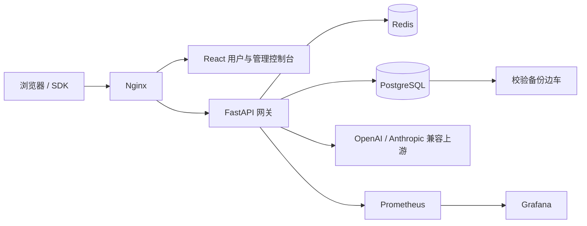

<div align="center">

# Open API Platform

**可自主部署、面向多模型供应商的大模型 API 网关与运营控制台。**

通过 OpenAI / Anthropic 兼容接口统一接入模型，同时自主掌控模型路由、凭据、
用量分析、流量治理与平台运营。

[](LICENSE)
[](https://github.com/xhongduo-tech/apiplatform/actions/workflows/ci.yml)


[快速开始](#快速开始) ·
[核心能力](#核心能力) ·
[API 兼容性](#api-兼容性) ·
[生产部署](#生产部署) ·
[版本边界](#开源版与企业版) ·
[项目文档](#项目文档) ·
[参与贡献](#参与贡献)

[English](README.md) · [简体中文](README.zh-CN.md)

</div>

> [!IMPORTANT]
> 本公开快照不包含原内部系统的真实用户、API Key、请求日志、上游凭据、
> 组织名称或基础设施拓扑。可选演示数据完全虚构，其中的演示 Key 均不可调用。

## 开源版与企业版

当前仓库是**公开的 Apache-2.0 开源社区版**。仓库内所有项目自研文件均属于
开源版本，不包含任何非开源企业实现。商业能力放在独立私有仓库
`apiplatform-enterprise` 中，并通过可选、版本化的扩展 API 依赖社区版发布。

文件归属、许可证、版本兼容与变更流程见
[开源版与企业版边界](docs/EDITION_BOUNDARIES.md)和机器可读的
[EDITION.json](EDITION.json)。

## 为什么选择 Open API Platform？

团队向内部或客户提供多种大模型时，通常需要的不只是一个反向代理。Open API
Platform 将流量转发的数据平面和运营管理的控制平面整合为一套可自主部署的系统：

| 统一接入 | 流量治理 | 可观测运营 | 灵活部署 |
| --- | --- | --- | --- |
| OpenAI / Anthropic 兼容 API、SSE 流式响应、供应商无关的模型标识 | 单 Key RPM/TPM、故障转移、熔断、审计日志、受控密钥交付 | 用户与管理控制台、用量分析、健康状态、报表、Prometheus 与 Grafana | Docker Compose、默认回环绑定、校验备份、全离线部署包 |

## 核心能力

- **多供应商网关**：通过统一端点中继 Chat Completions、Completions、
  Responses、Embeddings、Models 与 Anthropic Messages。
- **流式与可靠性**：异步 SSE 中继、模型路由、故障转移、可选熔断、连接预算
  与多节点状态协调。
- **密钥和账户全生命周期**：创建、领取、重新生成、撤销和恢复 API Key，
  不在数据库保留可恢复的客户端 Key 明文。
- **流量治理**：基于 Redis 的跨实例 RPM/TPM 限流，支持单 Key 覆盖值和明确的
  故障降级行为。
- **运营可视化**：请求元数据、Token、延迟、热力图、报表、审计日志、
  Prometheus 指标与 Grafana 看板。
- **管理员可配置品牌**：平台名、组织、支持/审批部门、联系方式、页脚和多语言
  文案均在后台配置，不编译进前端。
- **强化本地认证**：首次管理员认领、强密码、登录限流、HttpOnly Cookie 与
  服务端会话失效机制。
- **私有化与离线部署**：字体与资源本地化、强化容器、虚构演示数据和
  空气隔离环境镜像包。

## API 兼容性

| API 风格 | 端点 | 流式响应 |
| --- | --- | :---: |
| OpenAI Chat Completions | `POST /v1/chat/completions` | 支持 |
| OpenAI Completions | `POST /v1/completions` | 支持 |
| OpenAI Responses | `POST /v1/responses` | 支持 |
| OpenAI Embeddings | `POST /v1/embeddings` | 不适用 |
| OpenAI Models | `GET /v1/models` | — |
| Anthropic Messages | `POST /v1/messages` | 支持 |
| Anthropic Token 计数 | `POST /v1/messages/count_tokens` | 不适用 |

兼容性指本项目已经实现的网关契约，不代表支持所有供应商私有扩展字段。

## 系统架构



Nginx 托管 Web 应用并代理 API 流量；FastAPI 负责认证、路由、治理与流式中继；
PostgreSQL 保存配置和持久运营数据；Redis 协调限流、缓存与跨进程状态。

实现细节见 [技术架构](docs/TECHNICAL.md)。

## 快速开始

### 环境要求

- Docker 与 Docker Compose
- Python 3.11 或更高版本
- Node.js 24 或更高版本

启动开发环境：

```bash
./dev.sh
```

脚本会准备 PostgreSQL、Redis、Python 环境、数据库迁移、FastAPI 后端和 Vite
前端。

| 服务 | 本地地址 |
| --- | --- |
| 用户控制台 | <http://localhost:5173> |
| 管理控制台 | <http://localhost:5173/admin.html> |
| 后端健康检查 | <http://localhost:8010/health> |

```bash
./dev.sh --status    # 查看本地服务状态
./dev.sh --logs      # 跟踪后端日志
./dev.sh --stop      # 停止应用进程与开发 Redis
```

> [!NOTE]
> 开发凭据均明确标记为仅供本地使用。生产模式会拒绝缺失、弱口令和仓库示例密钥。

## 生产部署

仓库提供两种 Compose 入口：

| 文件 | 适用场景 | 命令 |
| --- | --- | --- |
| `docker-compose.yml` | 从源码检出直接构建后端和 Web 镜像 | `docker compose up -d --build --wait` |
| `docker-compose.app.yml` | 使用预构建发行镜像或离线部署包 | `docker compose -f docker-compose.app.yml up -d --wait` |

标准源码部署会启动 Nginx、FastAPI、PostgreSQL、Redis、定时校验备份、
Prometheus 和 Grafana。持久数据保存在 Compose 管理的独立卷中，不写入源码目录。

### 1. 创建环境变量文件

```bash
cp .env.example .env
```

为 `POSTGRES_PASSWORD`、`REDIS_PASSWORD`、`JWT_SECRET` 和
`ADMIN_BOOTSTRAP_TOKEN` 分别生成不同的随机值：

```bash
openssl rand -hex 32
```

生成用于数据库字段加密的独立 32 字节 URL-safe 密钥：

```bash
openssl rand -base64 32 | tr '/+' '_-' | tr -d '=\n'
```

将结果写入 `DATA_ENCRYPTION_KEY`。不要复用数据库密码、JWT 密钥或加密密钥，
也不要将 `.env` 提交到 Git。

纯净生产实例请设置 `DEMO_DATA_ENABLED=false`。首位管理员认领完成前，保持
`HTTP_BIND_ADDRESS=127.0.0.1`。

### 2. 使用 Docker Compose 校验、构建并启动

```bash
# 展开完整配置；必填变量缺失或为空时会在构建前直接失败。
docker compose --env-file .env config >/dev/null

# 构建平台镜像、启动完整服务并等待健康检查。
docker compose --env-file .env up -d --build --wait

docker compose ps
curl --fail http://127.0.0.1/health
```

如果当前 Compose 版本不支持 `--wait`，可去掉该参数，并通过
`docker compose ps` 等待 `postgres`、`redis`、`backend` 与 `nginx` 进入
healthy。后端启动时会自动串行执行 Alembic 迁移，不需要额外执行首次 seed 命令。
如 `HTTP_PORT` 不是 `80`，请在健康检查地址中带上实际端口。

生产服务默认绑定 `127.0.0.1`：

| 服务 | 默认地址 |
| --- | --- |
| 用户控制台 | <http://127.0.0.1/> |
| 管理控制台 | <http://127.0.0.1/admin.html> |
| 健康检查 | <http://127.0.0.1/health> |
| Prometheus | <http://127.0.0.1:9090> |
| Grafana | <http://127.0.0.1:3000> |

首次管理员初始化完成前请保持回环监听。随后再通过可信 TLS 反向代理、指定管理网
地址或显式设置 `HTTP_BIND_ADDRESS` 对外提供服务。

### 3. 日常运维与升级

```bash
# 只跟踪最近的应用日志，避免一次输出全部历史。
docker compose logs -f --tail=200 backend nginx

# 更新源码后重新构建，并滚动到新容器配置。
docker compose build --pull backend nginx
docker compose up -d --wait --remove-orphans

# 停止容器，但保留数据库、备份与监控数据卷。
docker compose down
```

生产环境不要执行 `docker compose down --volumes`：该命令会删除 PostgreSQL、
Redis、备份、Grafana、Prometheus 与用量故障缓冲卷。每次升级前应导出一份已校验
备份，并妥善保存与备份匹配的 `DATA_ENCRYPTION_KEY`：

```bash
bash scripts/export-backup.sh
```

容器日志默认按每个服务 10 MB × 5 个文件轮换；如宿主机采用不同日志策略，可在
`.env` 中覆盖 `DOCKER_LOG_MAX_SIZE` 与 `DOCKER_LOG_MAX_FILES`。

如需使用预构建发行镜像而不是本机编译，请在 `.env` 中把 `BACKEND_IMAGE` 和
`NGINX_IMAGE` 设置为精确版本标签，然后执行：

```bash
docker compose --env-file .env -f docker-compose.app.yml pull
docker compose --env-file .env -f docker-compose.app.yml up -d --wait
```

### 4. 认领首位管理员

发行版不携带固定 admin 密码。首次打开 `/admin.html` 时，由管理员创建强密码，
数据库只保存版本化 PBKDF2-SHA256 哈希。

建议启动前设置一次性 `ADMIN_BOOTSTRAP_TOKEN`。首次认领必须提供该令牌，
初始化成功后它不再参与登录。数据库锁保证 first-claim 操作的并发安全。

> [!WARNING]
> 请在本机或受信网络完成首次管理员认领后再开放服务。本发行版明确不包含外部
> SSO、OAuth、SAML、OIDC 或 CAS 登录集成。

### 5. 配置平台信息

登录后进入「后台 → 品牌配置」，设置平台名、品牌名、组织、支持/审批部门、
联系方式、页脚和多语言展示文案。配置保存在 PostgreSQL 中，不需要重新构建前端。

### 关键配置

| 变量 | 用途 | 生产建议 |
| --- | --- | --- |
| `POSTGRES_PASSWORD` | PostgreSQL 凭据 | 必填；使用独立随机值 |
| `REDIS_PASSWORD` | Redis 凭据 | 必填；使用独立随机值 |
| `JWT_SECRET` | 会话和令牌签名 | 必填；不要复用其他密钥 |
| `DATA_ENCRYPTION_KEY` | AES-256-GCM 数据库字段加密 | 必填；独立的 32 字节 base64url 值 |
| `ADMIN_BOOTSTRAP_TOKEN` | 首次管理员一次性认领 | 强烈建议配置 |
| `SESSION_COOKIE_SECURE` | Cookie 仅通过 HTTPS 发送 | 接入 TLS 后设为 `true` |
| `HTTP_BIND_ADDRESS` | Web 服务监听地址 | 初始化期间保持 `127.0.0.1` |
| `DEMO_DATA_ENABLED` | 为全新空库写入虚构数据 | 纯净实例设为 `false` |
| `USAGE_CONTENT_LOGGING_ENABLED` | 保存请求/响应正文 | 无明确需求时保持 `false` |
| `API_DOCS_ENABLED` | 提供动态 Swagger、ReDoc 与完整运行时 Schema | 保持 `false`；使用经过审阅的静态网关规范 |

部署关键配置及安全默认值见 [.env.example](.env.example)。

## API 调用示例

### OpenAI 兼容请求

```bash
curl http://127.0.0.1/v1/chat/completions \
  -H 'Authorization: Bearer YOUR_API_KEY' \
  -H 'Content-Type: application/json' \
  -d '{
    "model": "your-model-id",
    "messages": [{"role": "user", "content": "Hello"}],
    "stream": false
  }'
```

### Anthropic 兼容请求

```bash
curl http://127.0.0.1/v1/messages \
  -H 'x-api-key: YOUR_API_KEY' \
  -H 'anthropic-version: 2023-06-01' \
  -H 'Content-Type: application/json' \
  -d '{
    "model": "your-model-id",
    "max_tokens": 256,
    "messages": [{"role": "user", "content": "Hello"}]
  }'
```

管理员在后台注册模型并发放 Key；演示 Key 不能调用上游模型。

经过审阅且随版本发布的公开契约见
[`docs/openapi-gateway.json`](docs/openapi-gateway.json)。生产环境默认关闭
`/docs`、`/redoc` 和 `/openapi.json`，避免意外公开内部管理路由；仅应在可信的
开发或管理网络中设置 `API_DOCS_ENABLED=true`。

## 演示数据

`DEMO_DATA_ENABLED=true` 时，系统仅在 `users` 和 `api_keys` 都为空的新库中
写入虚构用户、已撤销 Key 和 30 天汇总趋势。演示数据不包含请求/响应正文、
详细错误、真实组织名称、基础设施地址或可用凭据。

需要完全空白的新实例时：

```dotenv
DEMO_DATA_ENABLED=false
```

## 安全设计

- API Key 明文只在领取或重新生成时返回一次，数据库使用 SHA-256 哈希认证客户端。
- 可恢复的上游凭据使用部署方控制密钥进行 AES-256-GCM 加密。
- 公开注册与基于 API Key 的密码找回默认关闭。
- 浏览器会话使用 HttpOnly、SameSite Cookie；改密、重置和删除账户会使旧会话失效。
- 请求与响应正文默认不落库。
- 从管理后台下载原始数据库备份需要部署方显式开启。
- PostgreSQL、Redis、Prometheus、Grafana 与 Web 入口默认仅绑定回环地址。
- 可信代理配置会拒绝全网网段。

请按照 [安全政策](SECURITY.md) 私下报告漏洞。不要在公开 Issue 中披露凭据、
数据库导出、私有日志或可直接使用的漏洞利用代码。

## 备份、恢复与离线部署

Compose 备份边车默认每小时生成并校验一份 PostgreSQL custom-format 快照，
保留最近 168 份：

```bash
bash scripts/export-backup.sh
bash scripts/restore-backup.sh /absolute/path/to/backup.dump
```

恢复操作会替换数据库状态。依赖任何备份前，请在隔离环境验证备份文件与对应的
数据加密密钥。

构建全离线部署包：

```bash
TARGET_PLATFORM=linux/amd64 bash build-offline.sh
cd offline-images
bash deploy-offline.sh
```

离线构建器会生成独立部署凭据，并拒绝收录 `.dump` 和 `.sql` 文件。
详见 [离线部署](OFFLINE.md)。

## 开发与验证

后端：

```bash
cd backend
python -m pip install -r requirements-dev.txt
python -m ruff check app tests ../scripts
python -m pytest
python -m alembic upgrade head
```

前端：

```bash
cd frontend
npm ci
npm run check:i18n
npm run typecheck
npm test
npm run build
```

发布关键浏览器链路（使用独立 Compose 项目、测试卷和
18080/65432/6399 端口）：

```bash
bash scripts/run-e2e.sh
```

公开发布前：

```bash
python scripts/check-version-sync.py
python scripts/export-openapi.py --check
bash scripts/check-public-release.sh
```

发布检查会扫描当前文件与 Git 历史中的凭据、数据库导出、旧组织标识、内部资料
和本地生成文件。`VERSION` 是唯一发行版本源；`v<版本号>` 标签必须指向六项发布
关键 CI 均已成功的提交。`.github/workflows/release.yml` 会把检查绑定到默认分支上精确的
push workflow run 与提交，复核版本/变更记录并在发布前扫描镜像；随后发布带版本的 GHCR
镜像、验证镜像包已公开且与仓库关联、对不可变摘要执行无密钥签名，并附加 SPDX SBOM
证明。GitHub Release 采用可恢复的草稿流程，逐项核对资产名称、大小与 SHA-256 后才发布，
且最终必须由 GitHub 标记为不可变。仓库管理员必须在创建 Tag 前启用不可变 Release。
个人账户首次发布的 GHCR 包默认为私有，因此工作流会在签名和 Release 创建前暂停；管理员
将两个包改为 **Public** 后，重新运行失败作业即可继续。

## 项目文档

| 文档 | 内容 |
| --- | --- |
| [技术架构](docs/TECHNICAL.md) | 运行时设计、数据链路与运维边界 |
| [故障转移](docs/fallback.md) | 路由兜底与熔断语义 |
| [调度机制](docs/scheduling.md) | 调度、Leader 选举与 Redis Sentinel |
| [离线部署](OFFLINE.md) | 空气隔离环境的构建和部署流程 |
| [发布清单](docs/RELEASE_CHECKLIST.md) | 公开发布前的验证步骤 |
| [开源发布复审](docs/OPEN_SOURCE_AUDIT.md) | 分级建议、审计证据与验收标准 |
| [版本边界](docs/EDITION_BOUNDARIES.md) | 公开社区版与私有企业版的归属和兼容规则 |
| [扩展 API](docs/EXTENSIONS.md) | 版本化加载契约、生命周期、安全依赖与 Provider 注册表 |
| [静态网关 OpenAPI](docs/openapi-gateway.json) | 经审阅的公开 `/v1` 与 `/beta/v1` 契约 |
| [变更记录](CHANGELOG.md) | 重要项目变更 |
| [安全政策](SECURITY.md) | 支持范围与私密漏洞报告流程 |
| [支持范围](SUPPORT.md) | 公开支持边界与问题分流 |
| [维护者](MAINTAINERS.md) | 维护角色与职责 |

## 项目结构

```text
backend/    FastAPI 网关、管理 API、迁移与测试
frontend/   React 控制台、文档界面、多语言与样式
nginx/      反向代理、静态站点与安全响应头
postgres/   PostgreSQL 配置、备份与健康检查
monitoring/ Prometheus 规则与 Grafana 看板
scripts/    部署、迁移、备份和发布工具
docs/       架构与运维文档
```

## 参与贡献

欢迎参与贡献。提交 Pull Request 前请阅读 [贡献指南](CONTRIBUTING.md) 与
[行为准则](CODE_OF_CONDUCT.md)。行为变更应包含测试和文档；迁移及配置变更
应说明升级与回滚方式。

## 许可证

Copyright 2026 徐鸿铎 and Open API Platform contributors.

本项目采用 [Apache License 2.0](LICENSE)，归属信息见 [NOTICE](NOTICE)。
